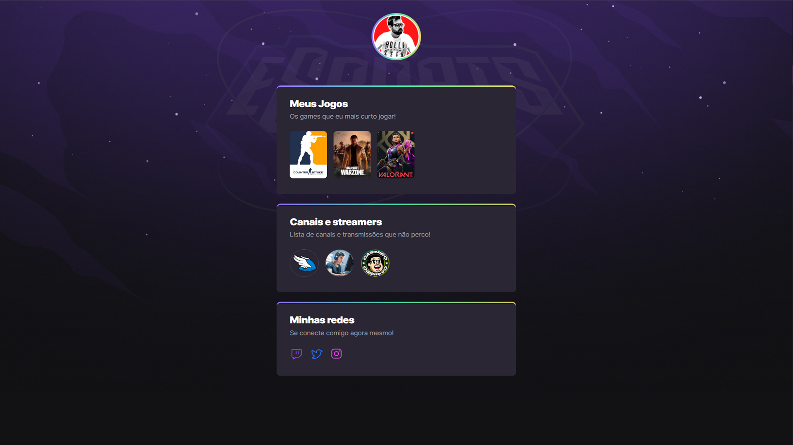

# NLW eSports - Rocketseat :rocket: 

Curso de Front-End basic trabalhando com HTML, CSS e JavaScript.
> Trilha Explorer

Projeto construído do evento Next Level Week da Rocketseat

:link: [Clique aqui para acessar](https://fernandonamba.github.io/NLW_eSports/)

## :wrench: Tecnologias

- HTML
- CSS
- GIT
- GitHub

## O que Aprendi?
  <h2>CSS</h2>

 - Utilização do nth-child  
 - @keyframe 
 - Utilização do background-img no repeat e background-color 

  <h2>GIT</h2>

 - Etapas básicas de Git 

  <h2>GITHUB</h2>

 - GitHub Pages

## :heart: Contato
:email: namba.fernando@gmail.com